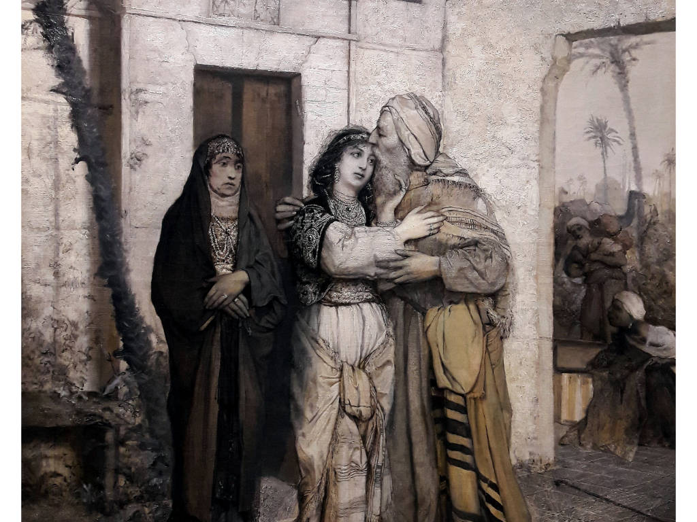

+++
title = "Aufwachsen zwischen zwei Herkünften: Ein Vergleich zwischen mir und Recha in Nathan der Weise"
date = "2024-10-31"
draft = false
pinned = false
tags = ["Deutsch", "NathanderWeise", "Blog", "Recha"]
image = "werke_271_orig.jpg"
footnotes = "Quellen:\n\nhttps://chatgpt.com"
+++

Im Rahmen des Deutschunterrichts haben wir das Drama *Nathan der Weise* von G. E. Lessing, das 1779 veröffentlicht wurde, gelesen. Ziel dieses Dramas war, die Ideen der Aufklärung auf den Punkt zu bringen. In der Klasse begannen wir damit, das Drama gemeinsam Kapitel für Kapitel zusammenzufassen. Anschließend analysierten wir, wie in dem Drama die Aufklärung dargestellt wird und wie die Figuren darauf reagieren. Schließlich tauchten wir tiefer in den literaturgeschichtlichen Überblick der Epoche der Aufklärung ein.

## Unterrichtsstoff

Zusammengefasst erzählt das Drama von einem jüdischen Kaufmann Nathan in Jerusalem während des Dritten Kreuzzuges, der sich für Toleranz und Humanität einsetzt. Nathan ist ein intelligenter und modellhafter Aufklärer in diesem Drama, die die Figuren fördert, ohne belehrend zu sein. In dem Drama sehen wir viele Konflikte und verschiedene Werthaltungen wegen fundamentalen Unvereinbarkeiten religiös inspirierter Weltorientierung der Figuren. Das Drama betont die Bedeutung der menschlichen Vernunft, insbesondere durch die Figur Nathan, der diese in aufklärerischen Gesprächen während des Stücks vermittelt. 

Nathan hat eine Adoptivtochter, Recha, die er aufnahm, nachdem ihre christliche Familie sie nicht mehr aufziehen konnte. Nathan zog Recha also als Jüdin auf und vermittelte ihr zugleich die Werte der Toleranz gegenüber Andersdenkenden und der Vermeidung von Vorurteilen. Diese Werte sind in der Zeit, in der das Drama spielt, besonders relevant, da es sich in einer Phase religiöser Spannungen befindet und die drei Weltreligionen auf engem Raum zusammenleben. Recha wächst in einem sehr aufgeklärten Umfeld auf. Obwohl ihre Erzieherin Daja, eine Christin, manchmal versucht, ihr christliche Ideen zu vermitteln – in der Hoffnung, dass Recha ebenfalls Christin wird – merkt Recha, dass Dajas Denkweise ihr fremd ist. Die Tatsache, dass Recha adoptiert wurde, bleibt zunächst ein Geheimnis und sie erfährt erst im Laufe des Dramas, dass sie von Geburt an Christin ist. Recha ist natürlich sehr verwirrt, als sie erfährt, dass Nathan nicht ihr leiblicher Vater ist und dass sie gar keine Jüdin ist. Sie hat Angst, ihren Vater zu verlieren und fühlt sich verloren bei dem Gedanken, dass sie zu einer anderen Religion gehört. Für sie spielt die Blutsverwandtschaft keine Rolle, da dies für sie bei einem Vater nichts ausmacht. Am Ende des Dramas erfährt Recha, dass ihre Familie aus Mitgliedern aller drei Weltreligionen besteht. Ihr Onkel, der Sultan (der muslimischer Herrscher zurzeit), ihr Bruder ein Tempelherr (Christ), und ihr Vater Nathan ein Jude. Diese Familie kann schließlich in Frieden und Akzeptanz zusammenleben und zeigt uns, dass wir in erster Linie Menschen sind und dass niemand aufgrund seiner Religion oder Herkunft besser oder schlechter ist. 

Nathan hat eine Adoptivtochter, Recha, die er aufnahm, nachdem ihre christliche Familie sie nicht mehr aufziehen konnte. Nathan zog Recha also als Jüdin auf und vermittelte ihr zugleich die Werte der Toleranz gegenüber Andersdenkenden und der Vermeidung von Vorurteilen. Diese Werte sind in der Zeit, in der das Drama spielt, besonders relevant, da es sich in einer Phase religiöser Spannungen befindet und die drei Weltreligionen auf engem Raum zusammenleben. Recha wächst in einem sehr aufgeklärten Umfeld auf. Obwohl ihre Erzieherin Daja, eine Christin, manchmal versucht, ihr christliche Ideen zu vermitteln – in der Hoffnung, dass Recha ebenfalls Christin wird – merkt Recha, dass Dajas Denkweise ihr fremd ist. Die Tatsache, dass Recha adoptiert wurde, bleibt zunächst ein Geheimnis und sie erfährt erst im Laufe des Dramas, dass sie von Geburt an Christin ist. Recha ist natürlich sehr verwirrt, als sie erfährt, dass Nathan nicht ihr leiblicher Vater ist und dass sie gar keine Jüdin ist. Sie hat Angst, ihren Vater zu verlieren und fühlt sich verloren bei dem Gedanken, dass sie zu einer anderen Religion gehört. Für sie spielt die Blutsverwandtschaft keine Rolle, da dies für sie bei einem Vater nichts ausmacht. Am Ende des Dramas erfährt Recha, dass ihre Familie aus Mitgliedern aller drei Weltreligionen besteht. Ihr Onkel, der Sultan (der muslimischer Herrscher zurzeit), ihr Bruder ein Tempelherr (Christ), und ihr Vater Nathan ein Jude. Diese Familie kann schließlich in Frieden und Akzeptanz zusammenleben und zeigt uns, dass wir in erster Linie Menschen sind und dass niemand aufgrund seiner Religion oder Herkunft besser oder schlechter ist.

## Ein persönlicher Blick auf Identität und kulturelle Spannungen

Die Familie, die am Schluss entsteht, finde ich sehr interessant, denn anscheinend können zu dieser Zeit doch Menschen verschiedenster Herkunft in Frieden zusammenleben. Dies wollte ich mit meinem Umfeld vergleichen, da ich zwei Seiten in mir habe, die nicht immer in Frieden miteinander sind. 

Ich bin in einer Familie aufgewachsen, in der mein Vater Türke und meine Mutter Kurdin ist.Mein Vater sagte mir als Kind oft, wie stolz ich doch sein sollte, eine Türkin zu sein und wie groß der Vater der Türken – Atatürk – ist. Meine Mutter hingegen hatte dazu nicht viel zu sagen. Nicht weil mein Vater ihr das direkt verboten hat, eher weil er mir mehr von der türkischen Seite gezeigt hat. Dies ist auch der Grund, warum ich die Einzige von meiner mütterlichen Seite bin, die kein Kurdisch kann, denn mein Vater war kein Fan davon mir die kurdische Sprache beizubringen. Man könnte fast meinen, dass mein Vater wie Daja ist. Darum kann man sich gut vorstellen, mit welcher Denkweise ich aufgewachsen bin. Als Kind war ich immer stolz darauf, eine Türkin zu sein und verteidigte meine Herkunft bei jeder Kritik, meistens während den Diskussionen am Familientisch in der Türkei. Solche politischen Diskussionen, die meist in den Ferien in der Türkei stattfanden, waren für mich normal. Hingegen habe ich nie etwas von meiner kurdischen Seite erfahren, außer von der Familie, die ich besucht habe*.* Ich wurde zugleich in einer atheistischen Erziehung großgezogen. Mein Vater wuchs in einer kleinen Stadt in der Türkei auf. Er wurde von streng muslimischen Eltern erzogen und merkte, dass das Konzept von Religion ihm nicht gefiel. So wurde er ein Atheist. Auch ich wurde so erzogen; mein Vater akzeptiert zwar Menschen mit Religionen, sieht Religonen an sich größtenteils als etwas Schlechtes und den Grund für viel Gewalt auf der Erde. Genauso wie Recha von Nathan übernahm ich die Ansichten meines Vaters und wurde stark von ihm geprägt und habe gelernt, offen zu sein und meine Mitmenschen in ihrer Ansicht zu jeglicher Religion zu tolerieren. Leider ist dies anders, wenn es um meine Herkunft geht. Es fällt mir eher schwer, meine kurdische Seite zu akzeptieren und das liegt sicherlich daran, dass ich schon viele  Streitigkeiten in meiner Familie erlebt habe und viele Meinungen -insbesondere die meines Vaters- gehört habe, sodass eine der zwei Kulturen in meiner Familie mir fremd ist - meine kurdische. Ich kann dennoch behaupten, dass meine Familie in gewisser Weise wie Rechas Familie am Ende des Dramas zusammenleben kann, da es eine grundlegende Liebe und Fürsorge unter uns gibt. Allerdings zeigt die Tatsache, dass ich mich auf beiden Seiten meiner Familie noch immer nicht vollständig zugehörig fühle und es bei politischen Diskussionen immer wieder zu Konflikten kommt, dass wir einander als Familie nicht ganz akzeptieren und tolerieren. Diskussionen sind zwar normal und gegenseitige Toleranz ist möglich, jedoch wird es problematisch, wenn es täglich zu lauten Auseinandersetzungen und gegenseitigen Beschuldigungen kommt, sodass sich am Ende meist jemand beleidigt fühlt.

Im Gegensatz zu Recha und Nathan bin ich in einem Umfeld aufgewachsen, in dem Offenheit und uneingeschränkte Akzeptanz nicht so einfach zu finden sind. Vielmehr erinnert mich meine Situation eher an die anderen Figuren in *Nathan der Weise*, deren Handlungen oft durch die Herkunft und kulturellen Unterschiede beeinflusst werden – bei mir zwar weniger extrem, aber dennoch spürbar.

## Fazit

Das sagt bereits viel darüber aus, dass es in der heutigen Zeit immer noch viele Konflikte zwischen Parteien gibt, die in ihrer Haltung sehr verhärtet sind. Beide Seiten agieren dogmatisch und können nicht in Frieden leben, ohne die Religion oder die Herkunft beiseitezulassen. Dies ist ein Blog aus der Perspektive eines Kindes, das in einer Familie mit solch beiden Seiten aufwächst und wie aktuell dies noch ist in unserer Gesellschaft.  



Auf die Idee für den Text bin ich eigentlich schnell gekommen, da wir im Deutschunterricht bereits über die Aktualität des Buches gesprochen hatten. Daher kam mir schnell der Gedanke, die Konflikte im Drama näher zu betrachten. Nach meiner Präsentation über die Idee meines Blogs meinte mein Lehrer zu mir, ich sei «eine kleine Recha». Das gab mir die Idee, meinen eigenen Standpunkt als jemand aus einer Familie mit starken Meinungen darzustellen.

Für den ersten Teil meines Blogs habe ich nur meine Unterrichtsnotizen genutzt. Im zweiten Teil habe ich hingegen auf keine Hilfsmittel zurückgegriffen, da dieser Teil eher meine persönlichen Erfahrungen  widerspiegelt. Den Text habe ich zwar selbst geschrieben, ihn dann aber mithilfe der KI grammatikalisch korrigieren und die Formulierungen «flüssiger» gestalten lassen.

Ob ich den Blog wirklich mag oder nicht, kann ich nicht beurteilen. Es fiel mir sehr schwer, über persönliche und eher heikle Themen zu schreiben – besonders, wenn es um mich selbst geht. Daher bin ich mir unsicher, wie ich meinen eigenen Text einschätzen soll.

