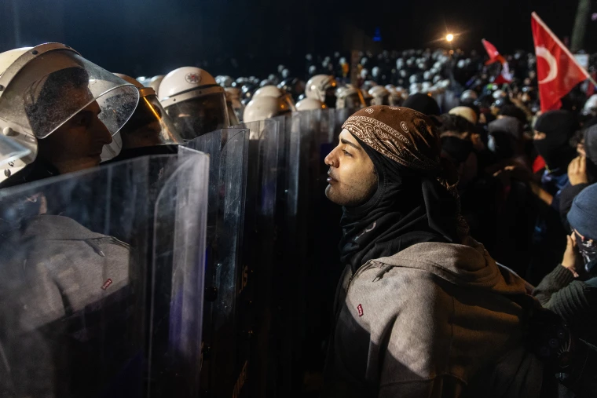

+++
title = "Die Demokratie der Türkei: Parallelen zu George Orwells 1984 "
date = "2025-04-29"
draft = false
pinned = false
tags = ["Demokratie", "Türkei", "Orwell", "1984", "Proteste"]
image = "250325-turkey-protests-mb-0825-4d42c7.webp"
+++
Im Englischunterricht letztes Jahr haben wir den Roman 1984 von George Orwell gelesen. Dabei analysierten wir das Werk, indem wir die darin dargestellte Überwachung mit realen und aktuellen Begebenheiten wie totalitäre Staaten oder Unternehmen wie Shein verglichen. In diesem Blog werde ich ebenfalls George Orwells 1984 mit der aktuellen Situation in der Türkei vergleichen – die türkische Demokratie. 

## George Orwells 1984

Der Roman schildert einen Staat, in dem Andersdenken mit Folter bestraft wird, in dem die Menschen rund um die Uhr überwacht werden und Parteipropaganda Rede- und Gedankenfreiheit zerstört, eine ernüchternde Erinnerung an die unkontrollierte Regime anrichten können. Die herrschende Partei überwacht jede einzelne Person und ihre Aktivitäten über Bildschirme – ein Überwachungsstaat, in dem es keine Freiheit gibt. Sie kontrolliert nicht nur die Bevölkerung Ozeaniens, sondern auch die Geschichte und die Sprache, indem sie etwa eine völlig neue Sprache (Newspeak) entwickelt, die politische Rebellion unmöglich machen soll, indem sie alle dafür notwendigen Begriffe eliminiert. Auch die Gedanken der Menschen werden kontrolliert. Ein einziger Gedanke gegen das System Ozeaniens oder gegen die Autoritäten zieht Konsequenzen nach sich. Wer eine Abneigung gegen die Partei empfindet und ein eigenständiges Individuum sein möchte, ohne sich mit der herrschenden Partei zu identifizieren, muss mit Strafen rechnen. Mit Einrichtungen, die entweder den Sprachgebrauch einschränken, die Geschichte des Landes zugunsten der aktuellen Politik umschreiben oder Andersdenkende mithilfe einer Gedankenpolizei als ‚Kriminelle‘ verfolgen, unterdrückt der Staat alles und jeden, der sich ihm widersetzt. Winston Smith, der Protagonist des Romans, gehörte zu den wenigen Menschen, die ‚rebellierten‘. Er selbst ist mit dem System in Ozeanien nicht einverstanden. Winston widersetzt sich der totalitären Kontrolle, indem er seine Liebe nicht dem Staat, sondern einer Frau zeigt und gewinnt dadurch ein Stück Selbstständigkeit zurück. Doch seine Rebellion bleibt nicht ohne Folgen: Er wird verhaftet, einer Umerziehung unterzogen und so manipuliert, dass er am Ende den Großen Bruder (Big Brother), den Führer des totalitären Regimes liebt.

## Die Türkei – Das neue Ozeanien? 

Man kann in George Orwells 1984 Parallelen zu verschiedenen realen Staaten erkennen. Besonders auffällig sind die Ähnlichkeiten zu Ländern wie Nordkorea. Mich persönlich interessiert jedoch vor allem ein Vergleich zwischen der aktuellen Lage in der Türkei und dem Roman 1984. Natürlich ist die Türkei längst kein totalitärer Überwachungsstaat wie Nordkorea – das muss deutlich gesagt werden. Dennoch lassen sich einige besorgniserregende Parallelen erkennen, insbesondere zwischen dem türkischen Staat unter der Kontrolle von Erdoğan und dem fiktiven Ozeanien unter der Herrschaft von Big Brother. Die entscheidende Frage lautet daher: Wird die Türkei die Demokratie, die sie sich vor 100 Jahren mühsam aufgebaut hat, an einen alternden Autokraten verlieren, der seine Macht nicht abgeben will? 

Als der Politiker Ekrem İmamoğlu am selben Tag verhaftet wurde, an dem seine Partei seine Präsidentschaftskandidatur bekannt gab, wollten viele Menschen (darunter auch zahlreiche Jugendliche) gegen den demokratischen Rückschritt unter Erdoğan und gegen seine Festnahme protestieren. Die türkischen Behörden reagierten auf die Demonstrationen mit der Verhaftung Hunderter Studierender. Laut dem Anwalt Cemil Cicek, der den ebenfalls festgenommenen Studenten Berkay Gezgin vertritt, richtete sich die Polizei gezielt gegen junge Menschen. Die Botschaft sei klar gewesen: Die Bevölkerung solle davon abgehalten werden, zu protestieren. Auch Eltern sollten durch das Vorgehen davon abgeschreckt werden, ihre Kinder zu unterstützen oder selbst auf die Straße zu gehen. Die CHP, Erdogans größte politische Konkurrenzpartei, wurde von Erdogan beschuldigt, jene zu schützen, die die Polizei angegriffen hätten. Gleichzeitig versucht Erdogan, den eigentlichen Grund der Demonstrationen zu verdrehen, indem er der Bevölkerung weismacht, die Demonstrierenden wollten die türkische Wirtschaft und das Wohlergehen des Landes sabotieren. Wer sich gegen die Nation auflehne, müsse zur Rechenschaft gezogen werden - eine Argumentation, die stark an die absurde Rhetorik in 1984's Ozeanien erinnert. Laut dem Guardian wurden die meisten verhafteten Studenten von der Polizei nicht darüber informiert, welcher Vorwurf gegen sie erhoben wurde. Vergleicht man nun die Merkmale eines orwellschen Überwachungsstaates mit der Situation in der Türkei, lassen sich durchaus Parallelen erkennen. Der Staat geht gegen sogenannte Gedankenverbrecher vor – Menschen, die es wagen, anders zu denken als es das System oder die herrschende Macht erlaubt. 

Es gibt sicherlich bereits ähnliche Schachfiguren in diesem Spiel. Erdoğan ist der „Big Brother“, die AKP die Partei Ozeaniens. Die türkischen Behörden, z.B. die Polizei, übernehmen die Rolle der Gedankenpolizei. Die CHP, Imamoğlu und all jene, die für die Demokratie ihres eigenen Landes demonstriert haben, stehen  für Winston Smith, den Menschen, der im Machtspiel der Machtsüchtigen gefangen ist. 

Beim Aspekt der Überwachung und Kontrolle ist der Vergleich zwischen der Türkei und dem fiktiven totalitären Staat Ozeanien in gewissem Maße zutreffend. In der Türkei werden manche Menschen wegen Twitter-Posts oder Likes verhaftet. Dies zeigt, dass der Staat Einfluss auf Internetdienste und Plattformen ausübt, jedoch nicht in totalitärer Weise.

Eine besonders treffende Parallele zu Ozeanien ist die eingeschränkte Meinungsfreiheit. Schon während dieser Proteste wurden tausende Schüler, Journalisten, die über die Demonstrationen berichteten, und sogar die Anwälte der Verhafteten festgenommen – ein deutliches Zeichen dafür, dass die Meinungsfreiheit in der Türkei nahezu nicht mehr existiert. Natürlich kann man innerhalb der Familie noch frei über Politik sprechen, da Menschen nicht durch Kameras überwacht werden. Schwieriger wird es jedoch, wenn Meinungen im Internet geäußert oder durch friedliche Demonstrationen vertreten werden. Auch die Angst vor Opposition lässt sich sehr gut mit Ozeanien vergleichen. Es werden ähnliche Maßnahmen ergriffen: Sobald es so aussieht, als könnte eine Opposition Erdogans auf faire Weise die Gunst der Bevölkerung gewinnen, muss sie ausgeschaltet werden, etwa durch Inhaftierung. Auch die Umerziehung Winstons in 1984 und Erdogans Aussage, dass demonstrierende Schüler in der Türkei eine Bedrohung für die türkische Wirtschaft und das gesellschaftliche Wohlbefinden darstellen und daher mit Konsequenzen rechnen müssten, erinnern stark an einen orwellschen Staat. Doch solche Aussagen Erdogans sind nicht die ersten, die er als Propagandataktik nutzt. Erdogan spielt gerne mit der Angst von Menschen mit nationalistischen Zügen, indem er sämtliche Gegner als Terroristen, Feinde des Islam (durch religiöse Manipulation) oder als Staatsfeinde bezeichnet.

## Fazit

Die Türkei zeigt autoritäre Tendenzen, insbesondere durch die Einschränkung der Meinungsfreiheit. Dennoch ist sie noch lange kein totalitärer Überwachungsstaat wie Ozeanien. Es gibt weiterhin Wahlen (auch wenn diese mehr oder weniger beeinflusst werden) und auch andere Parteien sind in der türkischen Politik nach wie vor zugelassen. Die Parallelen zu 1984 sollten zwar nicht übertrieben, aber dennoch klar benannt werden. Denn wenn es Hinweise darauf gibt, dass ein Land dabei ist, sich von der Demokratie zu verabschieden, sollte das nicht unbeachtet bleiben. Die Jugend ist ehrgeizig, und man merkt, dass das türkische Volk genug hat. Deshalb ist die Demokratie noch nicht außer Sicht geraten. Wenn die Proteste anhalten, könnte tatsächlich ein Wandel geschehen. Die eigentliche Frage lautet dann: Wie kann Erdogan, ein Autokrat, gestoppt werden?



Die Idee für den Blog kam mir direkt, nachdem die großen Proteste in der Türkei stattgefunden hatten. Ich wollte unbedingt darüber schreiben. Als ich dann einen passenden Unterrichtsaspekt zum Thema gefunden hatte, konnte ich sofort mit dem Schreiben beginnen. Für die Fakten über die Proteste in der Türkei nutzte ich The Guardian Weekly und für die Unterrichtsbesprechung meine Unterrichtsnotizen über George Orwells 1984. Den Text habe ich zunächst allein geschrieben und ihn dann von der KI auf grammatikalische Fehler und für einen flüssigeren Stil korrigieren lassen. Anschließend habe ich den Text noch persönlich angepasst. Der Schreibprozess hat mir Spaß gemacht, da ich mit relativ viel Selbstvertrauen über das Thema schreiben konnte. Im Grossen und Ganzen bin ich sehr zufrieden mit meinem Blog.

