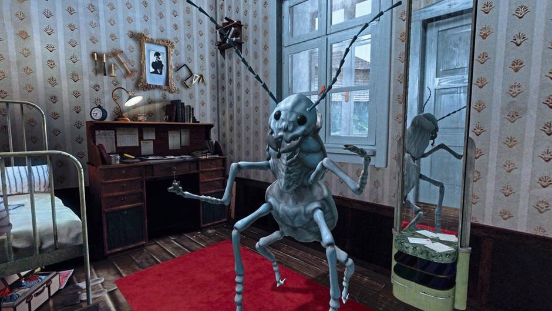

+++
title = "Ein Vergleich von Isolation und Ausgrenzung zwischen Kafkas \"Die Verwandlung\" und der LGBTQ-Community"
date = "2024-05-27"
draft = false
pinned = false
tags = ["Deutsch", "Blog", "Kafka", "DieVerwandlung", "LGBTQ+"]
image = "literatur-kafka-3.jpg"
+++

Im Rahmen des Deutschunterrichts haben wir in der Klasse die Erzählung "Die Verwandlung", die 1915 erstveröffentlicht wurde, von Franz Kafka gelesen. Kafka ist bekannt für seinen Schreibstil, der surreale Themen behandelt und oft Tiere mit menschlichen Zügen beinhaltet. Diese Ideen für seine Geschichten kamen aus den dunkelsten Tiefen seiner Träume, die er mit seinen Lebenserfahrungen zusammensetzte. Das Schreiben benötigte Kafka, um seine Emotionen auszudrücken; es war eine Art Überlebensstrategie für ihn. Damit wir die Erzählung verstehen konnten, haben wir in der Klasse den Text analysiert, Fragen geklärt und Deutungshypothesen aufgestellt.

## Unterrichtsnotizen

In Franz Kafkas "Die Verwandlung" stellt der Protagonist Gregor Samsa eines Morgens fest, dass er sich in der Nacht in ein Ungeziefer verwandelt hat. Gregor, der seine Familie hauptsächlich finanziell unterstützt, hätte eigentlich frühmorgens als Geschäftsreisender bei der Arbeit sein sollen. Zunächst verdrängt Gregor seine Verwandlung und ist überzeugt, dass diese vorübergeht. Nachdem jedoch Gregors Arbeitgeber und seine Familie nach ihm suchen, ist er gezwungen aufzustehen und somit die Realität anzuerkennen. Mit seinem veränderten Körper als Ungeziefer versucht er mühsam, seine Zimmertür zu öffnen. Seine Mutter und seine Schwester sind sehr entsetzt, als sie Gregor als Ungeziefer sehen, während sein Vater sehr aggressiv reagiert und ihn mit einem Stock ins Zimmer schlägt. Gregor erfährt keine Akzeptanz seiner Familie. Im Laufe der Geschichte nimmt die tierische Seite von Gregor zu. Er versucht zwar, als sein altes „Ich“ aufzutreten, merkt jedoch, dass sein Körper das nicht zulässt. Schließlich versteckt er sich unter dem Bett und kommuniziert nicht mehr mit seiner Familie.

Das Verhalten der Familienmitglieder sind sehr unterschiedlich. Während die Mutter immer noch Hoffnung und Fürsorge zeigt, ist der Vater gewalttätig und ablehnend. Beide Elternteile sind nicht in der Lage, sich an der Situation aktiv teilzunehmen. Gregors Schwester übernimmt die Verantwortung, sich um ihn zu kümmern. Sie versucht, ihm Komfort zu bieten, indem sie sein Zimmer umstellt und ihm Essen bringt.

Gregor hat im Laufe der Erzählung mit psychischen Problemen zu kämpfen. Obwohl er seine Familie nicht beunruhigen will und noch gewisse menschliche Züge wie Mitgefühl besitzt, erkennt er, dass er an Nützlichkeit verloren hat. Er kann der Familie keine finanzielle Unterstützung mehr bieten und ist nun auf sie angewiesen. Gegen Ende der Erzählung vernachlässigt auch seine Schwester Gregor. Die ganze Familie ist mit ihren eigenen Arbeiten beschäftigt und hat keine Zeit mehr für das Ungeziefer. In seinem Zimmer stirbt Gregor, was offensichtlich einen Selbstmord aus Empathie mit den Angehörigen symbolisiert.

## Die Ausgrenzung der LGBTQ-Community

Die Erzählung zeigt, wie Gregor aufgrund seiner Verwandlung in ein Ungeziefer nicht mehr den sozialen Normen entspricht und somit aus der menschlichen Gesellschaft ausgeschlossen wird und seinen Nutzen verliert. Die Isolation und Entfremdung, die Gregor erlebt, spiegeln die Herausforderungen wider, mit denen viele LGBTQ+ Personen konfrontiert sind, wenn ihre Identität nicht akzeptiert wird.

Die Diskriminierung und Gewalt gegen die LGBTQ-Community ist auch in moderner Zeit ein großes Thema. Laut Amnesty International, der Organisation für die weltweite Bewegung der Menschenrechte, werden jedes Jahr viele Menschen ermordet und misshandelt, nur weil sie sich offen zu ihrer gleichgeschlechtlichen Liebe bekennen oder sich nicht normgemäß kleiden. Solche Vorfälle erschweren das Coming-out erheblich. 

Wie bei Gregor Samsa, dessen Verwandlung und deren Enthüllung vor seiner Familie mit dem Coming-out vieler Menschen verglichen werden kann, erleben auch heute nicht alle Familien Akzeptanz, wenn ihr Kind nicht der Norm entspricht. In der Schweiz haben Attacken gegen LGBTIQ-Menschen erneut zugenommen. Der neueste Hate-Crime-Bericht der queeren Dachorganisationen Pink Cross, der Lesbenorganisation LOS und des Transgender Network Schweiz zeigt, dass die Anzahl der gemeldeten Vorfälle im Vergleich der Jahre 2021 zu 2022 um fast 50 % gestiegen ist, mit durchschnittlich drei gemeldeten Vorfällen pro Woche. In diesen Meldungen sind etwa 80 % der Fälle Beleidigungen und 20 % körperliche Gewalt. Trans-Personen sind überproportional betroffen und machen ein Drittel der Fälle aus.Aber auch in der schweizer Arbeitswelt herrscht noch keine diskrimierungsfreie Welt. Denn laut der "Transgender Network Switzerland" sind viele Transgender Personen von der Arbeitswelt isoliert, indem deren Arbeitslosigkeitenquote im Jahre 2018 bei 20% liegt. 

LGBT-Jugendliche weisen im Vergleich zu heterosexuellen Teenagern ein deutlich höheres Risiko für suizidales Verhalten auf. Die erhöhte Zahl an Suizidversuchen hängt nicht direkt mit der sexuellen Orientierung zusammen, sondern entsteht durch indirekte Faktoren wie Homophobie, Schikanen in der Schule oder fehlende Akzeptanz in der Familie. 

## Fazit

Obwohl Gregors Verwandlung auf einer nicht-menschlichen Ebene stattfindet, während die Isolation von LGBTQ+ Personen auf der menschlichen Ebene geschieht, zeigt die Geschichte dennoch, dass das Nicht-Angehören an soziale Normen zu einem Kreislauf psychischer Probleme führen kann.



Gregors Situation der Isolation im Rahmen sozialer Normen hat mich stark an die Probleme der LGBTQ+ Community erinnert, weshalb ich früh die Idee hatte, diese beiden Themen miteinander zu verbinden. Den Text habe ich grob alleine geschrieben, jedoch habe ich die KI als Hilfsmittel genutzt, um an manchen Stellen die Texte schöner zu formulieren und meine Meinung präziser auszudrücken. Zusätzlich habe ich die KI für die Korrektur von Grammatik und Kommasetzung genutzt. Meine Unterrichtsnotizen halfen mir, eine kurze Zusammenfassung der Erzählung und eine Einführung in das Thema zu geben. Außerdem habe ich ein paar Websites zur Bestätigung meiner Aussagen durch Statistiken verwendet.

Im Großen und Ganzen bin ich mit meinem Text sehr zufrieden. Mit mehr Zeit könnte ich jedoch meine Unterrichtsnotizen zur Erzählung noch präziser auf den Punkt bringen.



## Quellen

<https://mcusercontent.com/6c9ae273ae267809840328351/files/b4f2fe51-9a5e-5899-b577-b2e6e4b4970e/hatecrime_bericht_2023_DE.pdf>

<https://www.srf.ch/news/schweiz/zunahme-um-fast-50-prozent-angriffe-auf-lgbtiq-menschen-in-der-schweiz-auf-neuem-hoechststand>

 https://www.sgb.ch/themen/gleichstellung/detail/eine-diskriminierungsfreie-arbeitswelt-auch-fuer-lgbt

<https://vr-room.ch/wp-content/uploads/2018/07/literatur-kafka-3.jpg>