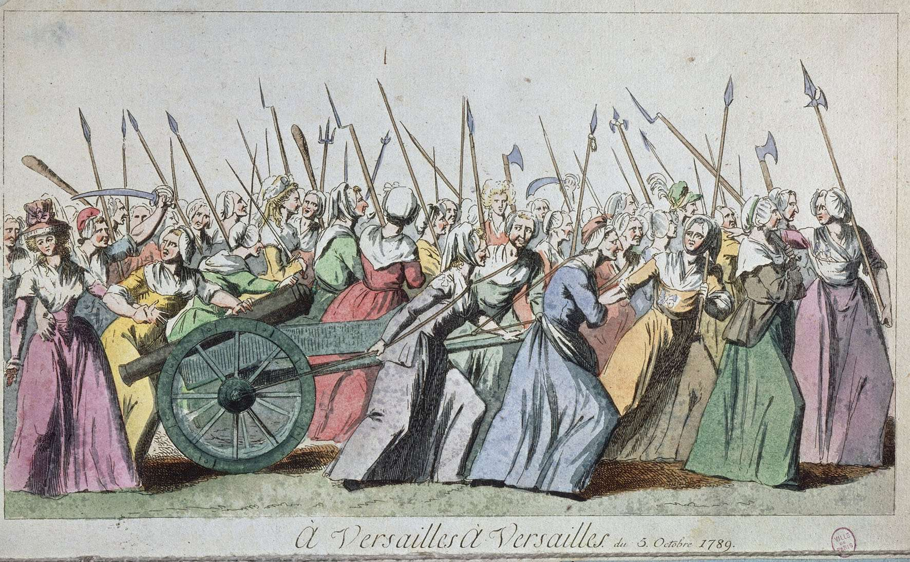
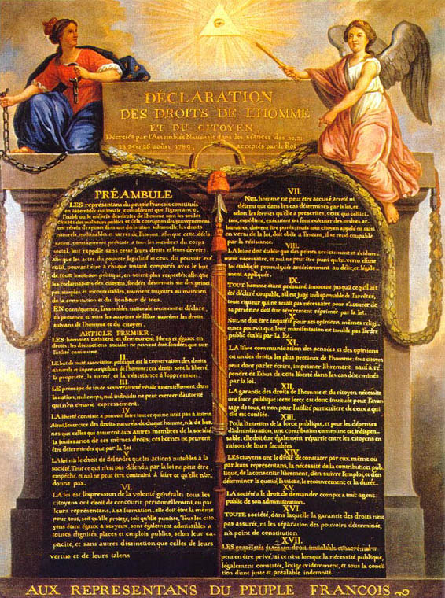

+++
title = "Le 18e siècle - Un siècle pour les femmes ? "
date = "2025-04-26"
draft = false
pinned = false
tags = ["18esiècel", "siècledeslumières", "Femmes", "Féminisme", ""]
image = "original.jpg.avif"
footnotes = "<https://studyflix.de/geschichte/franzoesische-revolution-3966>\n\n **<https://essentiels.bnf.fr/fr/image/04b3c9c5-f455-47d8-b889-59e546017fb8-bravoure-femmes-parisiennes-la-journee-5-octobre-1789>**\n\n**<https://www.youtube.com/watch?v=bI5JH3t8pGA>** \n\n**<https://social.shorthand.com/flotoooo/3yIcodJuqn/les-artisans-francais-de-la-lutte-feministe>**  \n\nhttps://de.wikipedia.org/wiki/Erklärung_der_Menschen-_und_Bürgerrechte\n\n**<https://essentiels.bnf.fr/fr/album/67c35ad2-f43f-46f6-818e-706d7f987ad2-salons-18e-siecle>**\n\n** <https://www.retronews.fr/journaux/etrennes-nationales-des-dames>**\n\nhttp://www.thucydide.com/realisations/comprendre/femmes/femmes1.htm\n\n https://www.ichfrau.com/frau-gesellschaft/keine-franzoesische-revolution-ohne-frauen/12131\n\nhttps://fr.wikipedia.org/wiki/Presse_féminine\n\nhttps://www.retronews.fr/journal/la-feuille-du-jour/28-jun-1791/1/d1f42274-7834-4953-a3cf-de5f1a34f177\n\nhttps://classes.bnf.fr/essentiels/albums/femmes/index.htm\n\nhttps://www.assemblee-nationale.fr/dyn/histoire-et-patrimoine/revolution-francaise/declaration-des-droits-de-la-femme-et-de-la-citoyenne-olympe-de-gouges#:~:text=En%201791%2C%20Olympe%20de%20Gouges,des%20femmes%20pour%20l'égalité."
+++
Le XVIIIe siècle, le siècle des lumières en d'autres termes, a fait beaucoup pour le développement de l'égalité. C'est certainement le point où les droits des femmes commencent à s'améliorer, n'est-ce pas ? C'est plus difficile qu'on ne le pense... Cette époque est très turbulente, enrichissante, mais aussi pleine de déceptions pour les droits des femmes. La question qui se pose maintenant est s'il y a eu des progrès en droits des femmes au XVIIIe siècle. Si oui, comment cela a aidé les femmes à améliorer l'égalité des droits ? 



Mon idée dans cet article de blog est de montrer les changements dans les droits des femmes au 18ème siècle. Je veux montrer un point de vue général sur le monde turbulent du 18ème siècle. Alors, mon objectif est de montrer comment les femmes ont décidé de défendre leurs droits avec la Révolution, comment elles y sont parvenues ou non, et quelles ont été les résultats de leurs efforts. Pour ce faire, je veux d'abord présenter de manière générale ce qu'était l'image des femmes au XVIIIe siècle. Ensuite, comment celle-ci a évolué, avec une description des mouvements des femmes contre l'injustice. Puis, à la fin, je comparerai les conséquences de l'activisme des femmes à la fin du XVIIIe siècle et leur degré de succès.

(La réflexion sur le feedback et la première version du blog est dans l'onenote (Selen Kaya --> littérature --> 18e siècle))



## La Révolution française - un bref résumé

Pendant la Révolution française (1789-1799), le but des gens ordinaires était trois choses : Liberté, égalité et fraternité. Au 18e siècle, il existait une hiérarchie des classes sociales, avec le roi Louis XVI en haut de la pyramide et les paysans et les ouvriers tout en bas. Les paysans étaient opprimés et politiquement désavantagés. Par exemple, ils étaient obligés de donner une partie de leurs récoltes aux nobles et étaient les seuls à payer des impôts. Donc, les causes de la Révolution française était l'insatisfaction sociale, l'oppression politique, la crise économique aiguë et la montée des idées des Lumières. La troisième classe avait suffisamment de conscience de soi pour enfin faire quelque chose. En conséquence de la Révolution, la Déclaration des droits de l'homme et du citoyen a été écrite. Cependant, ces droits ne s'appliquaient que pour les hommes et pas pour les femmes.

## Les femmes au 18ème siècle

Les femmes dépendaient de leur famille et de leur mari. La société était basée sur le concept de classe, cependant les femmes se trouvaient au bas de la hiérarchie sociale. Elles n'avaient pas le droit d'être autonomes et étaient subordonnées aux hommes. 

Au 18e siècle, la société était encore marquée par certains mythes chrétiens concernant la femme. La femme était notamment subordonnée à l'homme et était coupable envers lui (parce qu'Eve avait incité Adam à manger le fruit). Les femmes étaient donc sous la domination des hommes. Elles n'avaient pas droit à l'éducation, pas de droit de propriété et ne pouvaient travailler que dans des emplois très spécifiques pour le tiers du salaire. Donc, le patriarcat était en marche.

![Dans ce portrait, on peut voir comment la femme est limitée au ménage et à sa famille, sans homme en vue. Beaucoup de femmes sont oppressées par cette répartition des sexes : "En vérité, je suis bien ennuyée d'être une femme : il me fallait une autre âme, ou un autre sexe, ou un autre siècle. Je devais naître femme spartiate ou romaine, ou du moins homme français. [...] Mon esprit et mon cœur trouvent de toute part les entraves de l'opinion, les fers des préjugés, et toute ma force s'épuise à secouer vainement mes chaînes. O liberté, idole des âmes fortes, aliment des vertus, tu n'es pour moi qu'un nom !" (Mémoires de Madame Roland)](20201204055247000000_can_142.jpg)

Même si le 18e siècle a été le siècle des Lumières et une époque importante pour la science et l'égalité, ce n'était pas le cas pour la moitié de l'humanité - les femmes. Toutes les choses pour lesquelles on se battait pour l'égalité, la raison et la tolérance envers la religion et les autres ne concernaient pas les femmes - c'est très contradictoire, non ? Bien sûr, il y a eu quelques exceptions, car tous les hommes de la société n'étaient pas opposés aux droits des femmes. Il y avait des hommes, comme le Marquis de Condorcent, qui reconnaissaient que l'inégalité entre les hommes et les femmes était un problème.

> "*Je crois que la loi ne devrait exclure les femmes d'aucune place. \[…] Songez qu'il s'agit des droits de la moitié du genre humain*" Marquis de Condorcent 1787

## Les mouvements féminins pendant la Révolution 

Les femmes ont vu une opportunité avec la révolution de 1789 à 1791. Elles ont essayé de protéger leurs droits pendant la révolution par la publication de leurs opinions politiques dans la société par des organisations et par la publication d'écrits.

D'une part, il y avait des clubs de femmes où l'on débattait des droits des femmes et où l'on organisait activement les futures manifestations et les événements révolutionnaires. Certains de ces clubs avaient lieu dans des salons organisés par des femmes de la classe supérieure, qui étaient des espaces semi-publics où les hommes et les femmes pouvaient avoir des échanges intellectuels. De plus, certains de ces clubs collaboraient avec les Jacobins, comme la Société Patriotique et de Bienfaisance des Amis de la Vérité, en 1791-1792, qui défendait l'éducation des jeunes filles pauvres, le droit au divorce et les droits politiques des femmes.

D'autre part, il y avait aussi beaucoup de participation politique écrite. Pendant la révolution, des magazines féminins ont été publiés, avec des thèmes politiques, des questions d'égalité et d'autres sujets sociaux. Certaines femmes publiaient individuellement leurs opinions politiques sur des flyers et des pétitions. Les femmes essayaient d'attirer l'attention sur les problèmes traditionnels comme le droit à l'éducation, le pourcentage de mortalité à la naissance, le droit à l'exercice d'une profession...

![Avec les magazines, les femmes ont commencé à jouer un rôle social plus important, des journaux féministes ont été publiés et la Révolution de 1789 y a joué un grand rôle.  Les Étrennes nationales des dames, qui relataient le courage des femmes qui participaient aux manifestations et les encourageaient à continuer à se battre avec des mots courageux comme « Remettons les hommes sur leur chemin, et ne souffrons pas qu'avec leurs systèmes d'égalité et d'iberté ». Ces journaux, mais aussi la Feuille du soir (1791), créent de nouvelles voies pour faire l'attention sur les problèmes sociaux. ](images.jpeg)

Certaines des demandes des femmes étaient l'égalité des droits et des peines entre les hommes et les femmes, la réforme des lois sur le mariage, la libération de la dépendance des hommes, l'éducation scolaire et le droit de voter.

D'autres activistes féministes ont fait des discours publics et ont participé activement aux luttes et aux protestations. L'un des événements marquants de la participation active aux manifestations a été le mouvement des femmes des marchés à Versailles.

## La marche à Versaille

Des milliers de femmes ont marché de la mairie de Paris jusqu'au château du roi à Versailles le 5 octobre 1789. Plusieurs femmes (la plupart étaient des vendeuses, donc aussi celles qui ne supportent plus les hommes de pouvoir dans la hiérarchie) et quelques hommes ont marché pendant quatre heures dans la pluie. Elles se battaient pour leurs droits et voulaient un meilleur accès à la nourriture et contre la famine qui régnait à Paris. Ils criaient leur détresse au roi et voulaient du pain. Les femmes obtinrent du roi qu'il suspende certains décrets de l'Assemblée nationale et qu'il promette de fournir des vivres en faisant parler six femmes avec le roi. En plus de résoudre la famine, les femmes ont réussi à attirer l'Assemblée nationale, qui se trouvait à Versailles, à Paris pour ressentir directement sur place la pression de la révolution.  

Une vidéo sur YouTube qui montre comment la marche à Versailles était possiblement: 

 <https://www.youtube.com/watch?v=bI5JH3t8pGA >

### Mme Olympe de Gouges

Olympe de Gouges était une militante et une femme galante. Déjà avant la Révolution, elle s'engageait pour l'égalité des droits, contre le racisme et dans d'autres domaines politiques et sociaux, notamment à travers des pièces de théâtre qu'elle écrivait elle-même (bien qu'elles n'aient pas été reconnues à l'époque). Elle a joué un rôle très important dans le mouvement féministe et a vu dans la Révolution une opportunité de s'engager encore plus activement.Elle était sensible à l'injustice et a mené des actions politiques et sociales pour l'égalité des sexes. Elle a contribué à lutter pour l'égalité des sexes de manière pacifiste. Elle était la première à parodier la Déclaration des droits de l'homme et du citoyen (publié en 1791). Elle l'a présentée à l'Assemblée nationale. Elle y expliquait clairement que la réalisation de l'égalité ne pouvait se faire que si les deux sexes avaient les mêmes droits. L'Assemblée nationale a rejeté son écrit. Elle a ensuite été exécutée en 1793, accusée d'être un danger pour la révolution.

> Article 1: *La femme naît libre et demeure égale à l'homme en droits*
>
> *Articel 3: Le principe de toute souveraineté réside essentiellement dans la Nation qui n'est que la réunion de la Femme et de l'Homme.*

## Après la Révolution : un vrai changement ?

Vers la fin de la Révolution, l'Assemblée nationale en 1793 a progressivement interdit les clubs féminins et les journaux, et le travail politique des femmes a été réprimé.  Après la révolution, peu de voies ont été ouvertes pour l'égalité des droits des femmes. Ce résultat fut une déception pour les femmes les plus engagées. Il y avait certes des progrès civils comme le droit de hériter, à partir de 1792 les femmes pouvaient se marier librement ou refuser le mariage, le droit de divorcer et ainsi les femmes devenaient plus indépendantes. Cependant, le mandat universel a été refusé et introduit pour tous les hommes après la Révolution de 1791.

Lorsque Napoléon est entré en vigueur en 1804, avec ses lois (Code civil), les droits de l'homme ne s'appliquaient plus que pour les hommes et les femmes étaient à nouveau soumises aux hommes.  

> *,,Je n'apprécie pas les femmes qui se mêlent de politique* Napoleon" Napoleon

## Conclusion

Même si à la fin du 18ème siècle, la frustration était grande et que l'égalité des femmes n'était pas encore atteinte, l'histoire du 18ème siècle montre le courage des femmes et comment elles vont continuer à se battre jusqu'à ce que l'on puisse l'égalité. Bien que les activités des femmes n'aient pas eu beaucoup d'impact à cette époque, elles sont toujours importantes aujourd'hui, car Olympe de Gouges la Déclaration des droits de la femme et de la citoyenne est la fondation de l'égalité des droits dans de nombreux pays aujourd'hui.